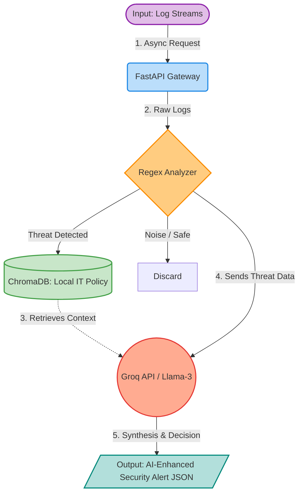

# 🛡️ AI-Powered Self-Healing System

[](https://www.python.org/)
[](https://fastapi.tiangolo.com/)
[](https://www.docker.com/)
[](https://python.langchain.com/)

> **An autonomous, AI-powered Site Reliability (SRE) and Security microservice that detects anomalies, consults internal company policies via RAG, and executes self-healing remediation steps.**

## Business Value (Why this exists?)
Modern IT Operations Centers (SOC/NOC) suffer from **Alert Fatigue**. Engineers waste hours verifying false positives or searching through massive IT manuals to find the correct remediation protocol for a specific threat. 

This project solves this by introducing a hybrid architecture:
1. **Deterministic Speed:** A highly optimized, asynchronous regex engine processes thousands of logs per second to catch true anomalies (e.g., Brute Force attacks).
2. **Context-Aware AI (Evidence-Based):** Instead of relying on an LLM's generic knowledge (which can hallucinate), the system uses **Retrieval-Augmented Generation (RAG)**. It searches the company's local, private IT operating procedures (Vector DB) and generates an action plan *strictly* based on internal compliance rules.
3. **Self-Healing:** Maps the AI's structured decision directly to actionable triggers (e.g., updating firewall rules dynamically).

## System Architecture

The system operates strictly on a **"Separation of Concerns"** principle. Below is the data flow topology of the microservice:



* **Log Analyzer Engine:** Filters noise, tracks time-windows (sliding window for rate limits), and triggers alerts with **100% Recall**.
* **Knowledge Ingestion (`ChromaDB`):** Converts company SOPs (Standard Operating Procedures) into vectorized chunks using HuggingFace sentence transformers, kept locally for **Data Sovereignty**.
* **AI Synthesis (`Groq / Llama-3`):** Combines the detected threat with the retrieved company policy to return a structured JSON action plan.

## Key Features
* **Zero-Hallucination Guardrails:** AI responses include exact source tracking (`policy_sources`). If the answer isn't in the manual, the AI triggers a predefined fallback rather than guessing.
* **Asynchronous I/O:** Built with `FastAPI` and `Asyncio` to ensure LLM network calls never block the main log processing event loop.
* **Production-Ready Containerization:** Multi-stage Docker builds reduce image size while running under non-root user privileges for strict security compliance.

## Performance & Evaluation Metrics
The system is continuously evaluated against a gold-standard dataset using a custom `pandas`-based evaluation pipeline. Current benchmarks:

| Metric | Score / Value | Note |
| :--- | :--- | :--- |
| **Throughput** | `35+ logs/sec` | Full E2E processing including DB search and LLM synthesis. |
| **Recall (Sensitivity)** | `100%` | Zero missed critical threats (Zero False Negatives). |
| **Precision** | `~90%` | Highly filtered keyword analysis reduces false positives. |
| **Latency** | `< 40ms` | Average processing time per log entry. |

## Tech Stack
* **Backend:** Python 3.12, FastAPI, Pydantic, Asyncio
* **AI / Machine Learning:** LangChain, HuggingFace (`all-MiniLM-L6-v2`), Groq API (Llama-3.1-8B)
* **Vector Database:** ChromaDB (Local Persistence)
* **Infrastructure & DevOps:** Docker, Docker Compose
* **Data & Testing:** Pandas, Pytest (Integrated via GitHub Actions CI/CD)

## Quick Start (Docker)

The application is fully containerized and independent of the host OS.

**1. Clone and Configure:**
```bash
git clone [https://github.com/recep-demir/ai_automation.git](https://github.com/recep-demir/ai_automation.git)
cd ai-self-healing-system
cp .env.example .env
# Add your GROQ_API_KEY to the .env file
```

**2. Build and Run:**
```bash
docker-compose up --build -d
```

**3. API Verification (Smoke Test):**
The API exposes an asynchronous endpoint. You can test it via terminal:
```bash
curl -X POST "[http://127.0.0.1:8000/analyze](http://127.0.0.1:8000/analyze)" \
     -H "Content-Type: application/json" \
     -d '{
       "logs": [
         "2026-04-12 10:00:01 - 192.168.1.50 - ERROR - Invalid password attempt",
         "2026-04-12 10:00:10 - 192.168.1.50 - ERROR - Invalid password attempt",
         "2026-04-12 10:00:20 - 192.168.1.50 - ERROR - Invalid password attempt",
         "2026-04-12 10:00:30 - 192.168.1.50 - ERROR - Invalid password attempt",
         "2026-04-12 10:00:40 - 192.168.1.50 - ERROR - Invalid password attempt" 
       ]
     }'
```

*Response Example:*
```json
{
  "status": "success",
  "alerts": [
    {
      "ip": "192.168.1.50",
      "status": "CRITICAL",
      "ai_recommendation": "Based on Rule 505 of the IT policy, block the source IP address (192.168.1.50) via the firewall immediately.",
      "policy_sources": ["it_policy.txt"]
    }
  ]
}
```

## Roadmap
- [x] Migrate from synchronous monolith to Async FastAPI microservice.
- [x] Implement local RAG architecture for policy-based decision-making.
- [x] Establish evaluation metrics (Precision/Recall script).
- [x] Containerize with Docker & Docker Compose.
- [x] Implement GitHub Actions for CI pipeline and automated Pytest execution.
- [x] Continuous Delivery (CD) integration with Docker Hub.